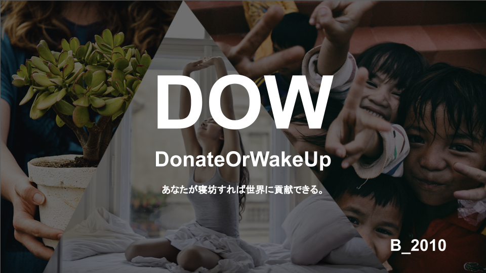
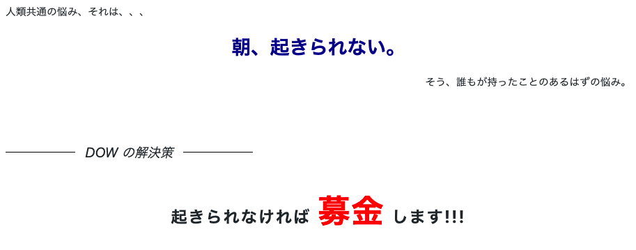
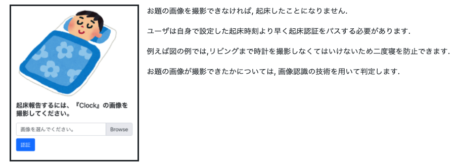
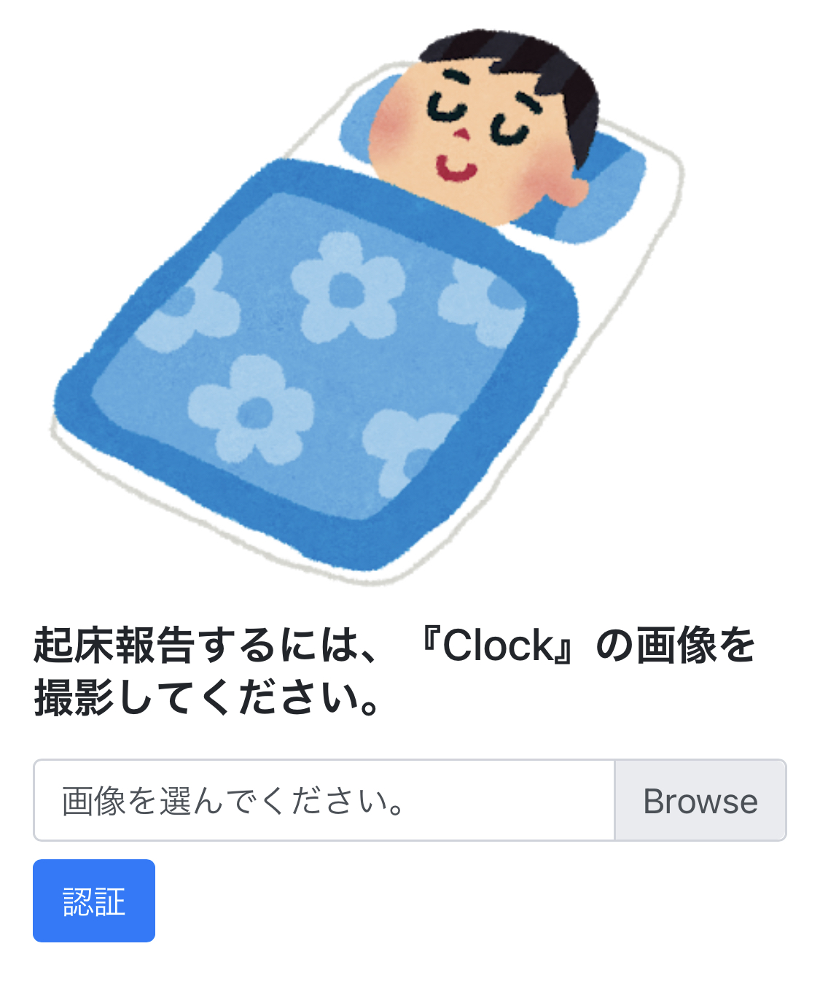
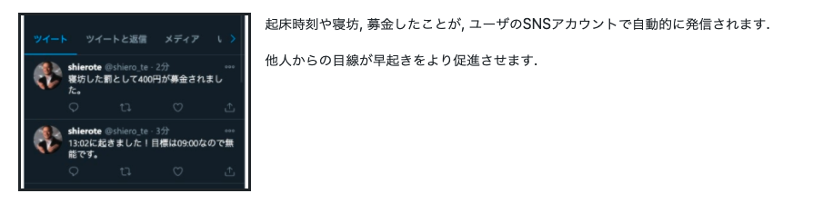
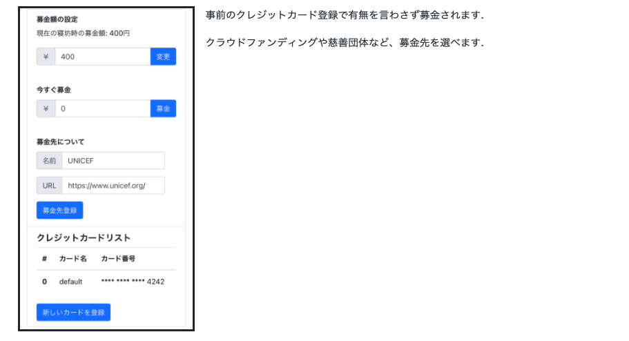
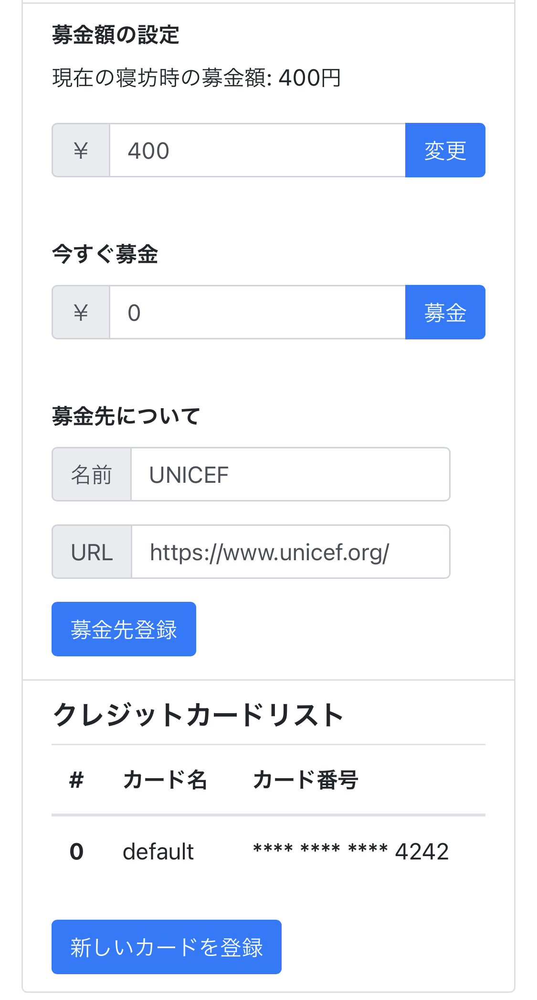

<h1>DOW</h1>

🔗 [Donate Or Wake up](http://dow.teguchi.jp)

<!-- 
人類共通の悩み、それは、、、

 朝、起きられない。

そう、誰もが持ったことのあるはずの悩み。

 
 
 

<i>DOW の解決策</i>

  起きられなければ募金します!!!

 -->

## 製品概要

### 製品説明（具体的な製品の説明）

早起きを三つの観点からサポート

### 特長

#### 1. 起床認証

<!-- 

  
  

    
お題の画像を撮影できなければ, 起床したことになりません.

    
ユーザは自身で設定した起床時刻より早く起床認証をパスする必要があります.

    
例えば図の例では,リビングまで時計を撮影しなくてはいけないため二度寝を防止できます.

    
お題の画像が撮影できたかについては, 画像認識の技術を用いて判定します.

  

 -->

#### 2. SNS 共有

<!-- 

  
  

    
起床時刻や寝坊, 募金したことが, ユーザのSNSアカウントで自動的に発信されます.

    
他人からの目線が早起きをより促進させます.

  

 -->

#### 3. 自動募金

<!-- 

  
  

    
事前のクレジットカード登録で有無を言わさず募金されます.

    
クラウドファンディングや慈善団体など、募金先を選べます.

    

  

 -->

### 今後の展望

- 起床や支払い金額に関する統計情報を出す.
- 入眠から起床まで全てを担当するアプリ(iOS)にする.
- ユーザが起きた情報をシェアできる SNS を増やす.(LINE グループで情報をシェアできるなど)
- 顔の表情から眠さを検知する機械学習を導入する.

### 注力したこと（こだわり等）

- **ちゃんと**作った
  - Stripe の導入
  - スケーラブルなインフラ
  - CI/CD

## 開発技術

### 活用した技術

#### API

- Google Cloud Vision

#### フレームワーク・ライブラリ・モジュール

- インフラ
  - AWS ECS (アプリケーション)
  - Aurora (DB)
  - System Manager/Parameter Store (秘匿値管理)
- フレームワーク, 言語
  - typescript
  - express.js
  - passport.js
  - typeorm
  - twitter API
  - Stripe (決済)
- CI/CD
  - Github Action
    - test & lint check
    - deploy

### 独自技術

#### ハッカソンで開発した独自機能・技術

- あえていうならば、システム全体
